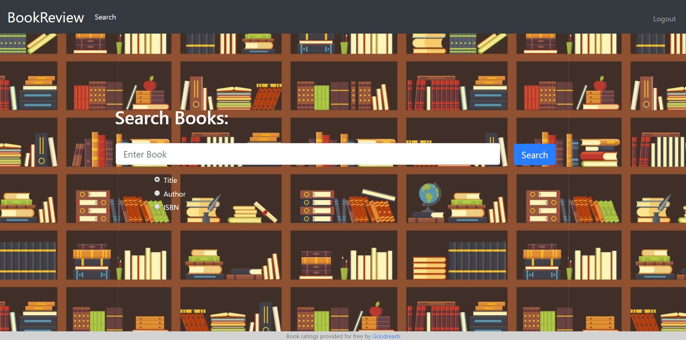

# BookReview
A Book Reviews website based on viewing book ratings through the Goodreads API, as well as allowing users to input their own reviews and view other reviews.

This web application is built with **Flask** in Python and using a **PostgreSQL Database**.

## Built With
* **Flask Web Framework and Sessions** used for server-side management
* **PostgreSQL Database** used for data storage on the book collections, reviews, and users
* **Goodreads API** to fetch the average book rating of a particular book in a **JSON** response
* **Bootstrap 4** used for styling web pages, along with custom **CSS** code
* **Jinja 2** for HTML templating

## Features
* Sign In and Registration of users
* Search intelligently through the book title, book author, or the ISBN to get all close matches
* View all key information of a book, its average rating on Goodreads, and view and formulate book reviews

## Screenshots for Demo
**Note:** The environment variables for the PostgreSQL database and the Goodreads API will need to be set. The CSV file shows the sample of the book collection that was used in the database.

  
  
  
  

